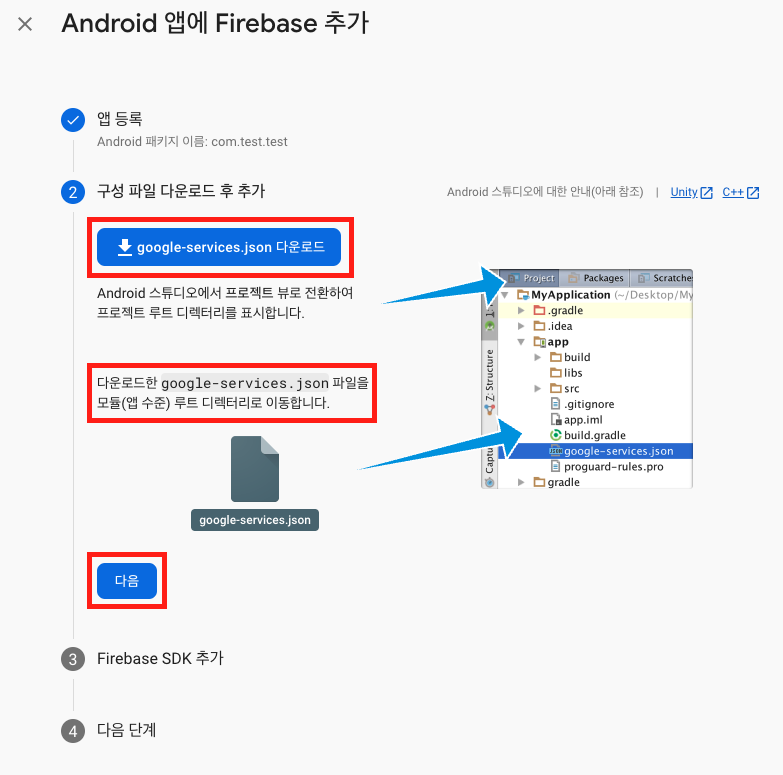
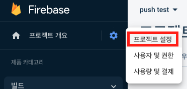
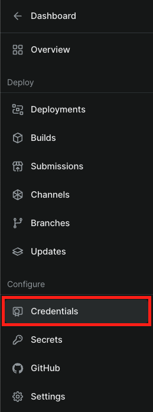

## 📂 delivery-app

### Expo 빌드, 배포 테스트

- [apk 빌드 완료](https://www.notion.so/hyungjinhan/Expo-Window-IOS-c9a32d8282b84d36909cf9ff98f3a763?pvs=4#41014ccbaefb483cb2db7104981ee2fd)

<br/>

## ~~📂 test~~

### ~~RTSP 영상 스트리밍 테스트~~

- ~~[`react-native-vlc-media-player`](https://github.com/razorRun/react-native-vlc-media-player)~~

<br/>

## 📂 video-test

### Expo 영상 출력

- [`expo-av`](https://docs.expo.dev/versions/latest/sdk/av/)

  - [`Video` Document](https://docs.expo.dev/versions/latest/sdk/video/#video)

  - [`m3u8` 확장자 활용](https://gist.github.com/lucky-c/91d96977f913d54f723b64c34ce03fac)

    - ios 환경에서는 재생 불가 ([`react-native-livestream` 활용](https://docs.api.video/docs/react-native-livestream-component))

### 스크린샷 테스트

- [`react-native-view-shot`](https://github.com/gre/react-native-view-shot)

  - [`captureRef` Document](https://docs.expo.dev/versions/latest/sdk/captureRef/#capturerefview-options)

### 가로 모드로 고정

- [`expo-screen-orientation`](https://docs.expo.dev/versions/latest/sdk/screen-orientation/)

  - [`orientationlock` Document](https://docs.expo.dev/versions/latest/sdk/screen-orientation/#screenorientationlockasyncorientationlock)

  - [`Video onFullscreenUpdate` Document](https://docs.expo.dev/versions/latest/sdk/video/#videofullscreenupdate)

### 푸쉬 알림 테스트

- [`expo-notifications` (알림 기능)](https://docs.expo.dev/versions/latest/sdk/notifications)

  - 특정 트리거 발동 시 알림 출력 가능

    - 물리적인 디바이스 환경에서만 알림을 위한 토큰이 생성되므로 에뮬레이터 환경에서는 테스트 불가

  - ~~[알림 아이콘 변경은 빌드를 통해 테스트가 가능할 것으로 보임](https://velog.io/@hhhminme/%EC%95%84%EC%A7%81%EB%8F%84-Push-Notification-%EC%9C%BC%EB%A1%9C-%EA%B3%A0%EC%83%9D%ED%95%98%EC%84%B8%EC%9A%94-Expo-Notification)~~

    - 테스트 결과, `app.json` 설정 후 빌드를 통해 아이콘 변경됨이 확인

  - [`expo-notifications` 알림 테스트 사이트](https://expo.dev/notifications)

<details>
  <summary>FCM 설정</summary>

1.  Firebase 프로젝트 생성

2.  프로젝트에 안드로이드 앱 추가

    

3.  해당 프로젝트의 안드로이드 패키지 이름과 동일하게 입력 및 앱 등록

    

4.  해당 `google-services.json` 파일을 다운로드 후, 안내에 따라 설정

    

5.  Firebase SDK 추가는 다음으로 넘어가기

6.  앱을 실행하여 설치 확인은 이 단계 건너뛰기로 넘어가기

7.  Firebase 프로젝트의 설정에서 클라우드 메시징 탭을 통해 `Cloud Messaging API` 서버 키 활용

    

    - 서버 키가 없다면 Google Cloud Service를 통해 `Cloud Messaging API` 사용 설정을 별도로 진행

8.  해당 프로젝트의 `app.json`에서 `google-services.json` 파일과 연동

    ```json
    "expo": {
      "android": {
        "package": "com.odndevel.videotest",
        "googleServicesFile": "./google-services.json",
      },
    }
    ```

9.  `expo push:android:upload --api-key <Cloud-Messaging-API-서버-키>` 터미널에 입력으로 FCM 토큰 값 입력

10. Expo 대쉬보드로 이동 후 `Credentials` 탭으로 이동하여 확인 가능

      

</details>

### 카카오 로그인 (REST API + WebView 사용)

- Expo 환경에서 테스트 가능

- [유용한 블로그 링크](https://angelpsyche.tistory.com/62)

- 개발 환경에서의 WebView에 보여줄 uri ex) http://172.30.1.48:19000/KakaoLogin

  - http://172.30.1.48:19000 -> Expo 기본 URL (exp://172.30.1.48:19000)

  - Kakao developers의 카카오 로그인에 Redirect URI를 등록해야 함

  - 실제 배포된 페이지를 만들어서 `Cannot GET /KakaoLogin` 에러 수정

- 웹뷰를 통해 카카오 로그인 창이 뜨며, 로그인을 위한 동의 항목 체크 페이지로 Redirect됨

- [인가 코드 받기](./video-test/screens/KakaoLogin.jsx)

  ```JavaScript
    uri: `https://kauth.kakao.com/oauth/authorize?response_type=code&client_id=${REST_API_KEY}&redirect_uri=${REDIRECT_URI}`
  ```

- 액세스 토큰 발행

  ```JavaScript
    import AsyncStorage from "@react-native-async-storage/async-storage";
    import axios from "axios";

    // 발급받은 액세스 토큰을 react native의 async-storage에 저장하여 다른 페이지에서도 활용 가능
    const storeToken = async (accessToken) => {
      try {
        await AsyncStorage.setItem("userAccessToken", accessToken);
      } catch (error) {
        console.log(error);
      }
    };

    axios({
      method: "post",
      url: "https://kauth.kakao.com/oauth/token",
      params: {
        grant_type: "authorization_code",
        client_id: REST_API_KEY,
        redirect_uri: REDIRECT_URI,
        code: `${위에서 받은 인가코드}`,
      },
    })
      .then((res) => {
        accessToken = res.data.access_token;
        storeToken(accessToken);
      })
      .catch((error) => {
        console.log(`Error : ${error}`);
      });
  ```

  - 토큰 만료 시간

    - Access Token 만료 시간 : 21599초 (6시간)

    - Refresh Token 만료 시간 : 5183999초 (60일)

      - ~~변환 사이트만 믿었다가 계산 잘못된거 알고 다시 계산한 결과 토큰 만료기간 2달 맞음~~

  - `logout`, `unlink` 하기 전까지는 만료 시간이 되면 자동 토큰 파기

    - 자동 로그인 기능을 위해서는 Refresh Token을 사용해야 할 듯

- 발급받은 액세스 토큰을 통한 유저 정보 가져오기

  ```JavaScript
  import AsyncStorage from "@react-native-async-storage/async-storage";
  import axios from "axios";

  const getInfo = async () => {
    try {
      const accessToken = await AsyncStorage.getItem("userAccessToken");
      // 저장된 액세스 토큰에 접근

      if (accessToken !== null) {
        axios({
          method: "get",
          url: "https://kapi.kakao.com/v2/user/me",
          headers: {
            Authorization: `Bearer ${accessToken}`,
          },
        })
          .then((res) => {
            console.log(
              `
              userAccessToken : ${accessToken}
              Nickname : ${res.data.kakao_account.profile.nickname}
              Email : ${res.data.kakao_account.email}
              `
            );
          })
          .catch((err) => {
            console.log(`Error : ${err}`);
          });
        }
      } catch (err) {
        console.log("error", accessToken);
      }
    };
  ```

### 카카오 로그인 구현 (SDK 사용)

- `EAS build` or `prebuild`를 통해서만 테스트 가능

- [`@react-native-seoul/kakao-login` GitHub](https://github.com/crossplatformkorea/react-native-kakao-login)

  - [`config-plugin`을 설정하여 사용할 수 있는 방법이 존재하는 듯](https://velog.io/@uffetkk/expo%EC%97%90%EC%84%9C-%EC%9B%B9%EB%B7%B0%EC%97%86%EC%9D%B4-%EC%86%8C%EC%85%9C%EB%A1%9C%EA%B7%B8%EC%9D%B8%ED%95%98%EA%B8%B0)

  - `app.json` 파일을 수정하여 구현하는 방식인 만큼, EAS를 통한 빌드 후 작동 테스트 예정

  - ~~테스트 결과, `kotlinVersion` 오류로 인해 빌드 실패~~

    ```bash
    [stderr] The Android Gradle plugin supports only Kotlin Gradle plugin version 1.5.20 and higher.
    [stderr] The following dependencies do not satisfy the required version:
    [stderr] root project 'video-test' -> org.jetbrains.kotlin:kotlin-gradle-plugin:1.5.10
    ```

    - `app.json` 수정을 통해 구현 성공

      ```json
      "plugins": [
        [
          "@react-native-seoul/kakao-login",
          {
            "kakaoAppKey": "KAKAO_네이티브_앱_키",
            "kotlinVersion": "1.5.20" // -> 버전 수정
             // 라이브러리에서 자체적으로 적용한 버전은 1.5.10
          }
        ]
      ],
      ```

  - `getProfile()` 메서드를 통해 로그인 후, 로그인된 정보 값을 받아올 수 있는지 테스트 필요

    - [참고할 만한 블로그](https://sumini.dev/guide/013-react-native-kakao-login/)

    - 현재 로그인 버튼을 눌렀을 때, 카카오톡 앱이 실행되고 로그인에 필요한 동의 항목까지는 표시

    - 이 후의 진행 사항은 빌드를 통해서만 확인이 가능함

### React Query (데이터 통신 작업)

- [React Query Repo 참고](https://github.com/HyungJinHan/react-query-study)

- [공식 Docs 한글 번역 Repo](https://github.com/ssi02014/react-query-tutorial)

### 휴대폰 인증

- [아임포트 결제 및 휴대폰 인증](https://github.com/iamport/iamport-react-native)

  - [Expo와 아임포트 연동](https://github.com/iamport/iamport-react-native/blob/main/manuals/EXPO.md)

- [나이스 본인인증 PASS 사용](https://velog.io/@soonmuu/React-Native-%EB%82%98%EC%9D%B4%EC%8A%A4-%EB%B3%B8%EC%9D%B8%EC%9D%B8%EC%A6%9D-pass-%EC%82%AC%EC%9A%A9%ED%95%98%EA%B8%B0)

  - Expo 환경에서는 `eject` 후 사용 가능

<br/>

## 📂 video-test-copy

### `expo eject`

- ~~`expo eject`은 삽질~~ -> `npx expo prebuild`를 통해서 최신 SDK를 eject 가능

  - 안드로이드 스튜디오에서 📂 android를 프로젝트로 열어서 jdk 버전(`17.0.6`)을 맞춰야 할 수 있음

    

### `React Navigation`

- Expo 환경에서는 문제없이 돌아가지만, `prebuild` 후에 문제가 됨

  - `RNSScreenStackHeaderConfig` 에러 메세지

- 해결 방법

  - 해당 프로젝트를 안드로이드 스튜디오로 실행 (버전 자동 동기화를 위함)

    - 안드로이드 스튜디오 > 해당 프로젝트 > 📂 android

  - ⚙️ Project Structure > Project

    | Name                          | Version |
    | ----------------------------- | ------- |
    | Android Gradle Plugin Version | 7.4.1   |
    | Gradle Version                | 7.5.1   |

  - 🔧 Preferences > Build, Execution, Deployment > Build Tools > Gradle

    | Name       | Version                 |
    | ---------- | ----------------------- |
    | Gradle JDK | 17.0.6 (jbr-17, etc...) |

<br/>

## 💡 기타 참고 사항

### [테스트용 비디오 모음 링크](https://gist.github.com/jsturgis/3b19447b304616f18657)

### Expo 환경에서 RTSP 영상 스트리밍은 불가

- `eject`를 진행한 후, react native 환경에서 가능

### Expo eject 후, 안드로이드 가상 디바이스 실행 에러 발생

- 원인, 설정법 찾아야 함

### `Toast` (`Alert` 대체제)

- [`react-native-toast-message` (Toast 알림)](https://github.com/calintamas/react-native-toast-message)

  - 느낌이 어떤지 테스트 할 예정

  - Alert은 가능, Confirm이 가능한지는 확인해봐야 함

- [`react-native-easy-toast` (다른 Toast 알림)](https://github.com/crazycodeboy/react-native-easy-toast)

  - Toast 커스텀이 비교적 쉬운 편 (ref를 이용)

  - 마찬가지로 Confirm이 가능한지는 확인 필요

### Expo Splash

- [`expo-splash-screen`](https://docs.expo.dev/versions/latest/sdk/splash-screen/)

  - 기본적으로 Expo를 세팅하면 자동으로 라이브러리 설치됨

- [도움되는 블로그](https://bskyvision.com/entry/react-native%EB%A1%9C-%EC%9B%B9%EB%B7%B0%EC%95%B1-%EB%A7%8C%EB%93%A4%EA%B8%B0)
